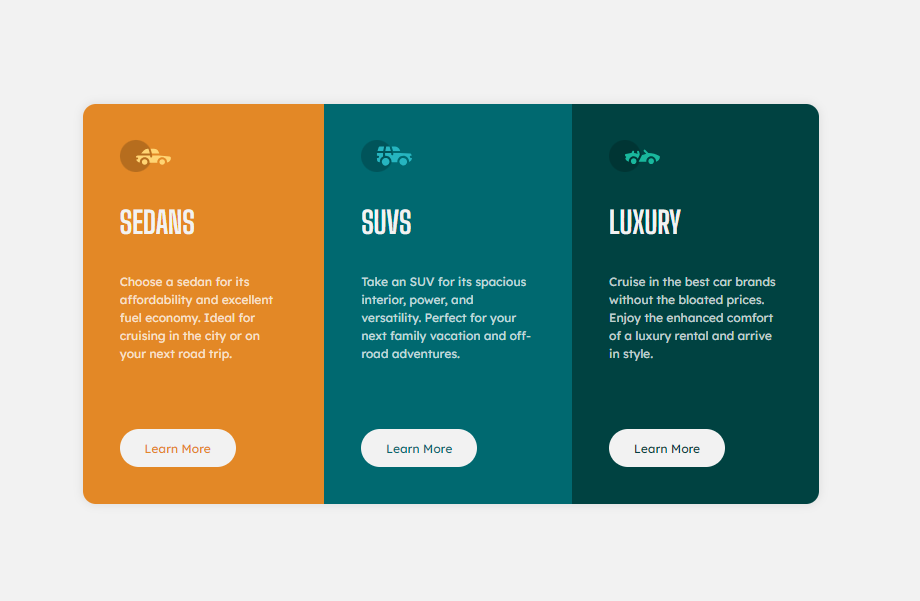

# Frontend Mentor - 3-column preview card component solution

This is a solution to the [3-column preview card component challenge on Frontend Mentor](https://www.frontendmentor.io/challenges/3column-preview-card-component-pH92eAR2-).

## Table of contents

- [Overview](#overview)
  - [The challenge](#the-challenge)
  - [Screenshot](#screenshot)
  - [Links](#links)
- [My process](#my-process)
  - [Built with](#built-with)
- [Author](#author)

**Note: Delete this note and update the table of contents based on what sections you keep.**

## Overview

### The challenge

Users should be able to:

- View the optimal layout depending on their device's screen size
- See hover states for interactive elements

### Screenshot

### Links

- Solution URL: [https://github.com/fido1hn/fem-3-column-preview-card-component-main](https://github.com/fido1hn/fem-3-column-preview-card-component-main)
- Live Site URL: [https://fido1hn.github.io/fem-3-column-preview-card-component-main/](https://fido1hn.github.io/fem-3-column-preview-card-component-main/)

## My process

### Built with

- Semantic HTML5 markup
- CSS Media Queries
- Flexbox

## Author

- Website - [https://fido1hn.github.io/](https://fido1hn.github.io/)
- Frontend Mentor - [@fido1hn](https://www.frontendmentor.io/profile/fido1hn)
- Twitter - [@fido1hn](https://www.twitter.com/yourusername)
